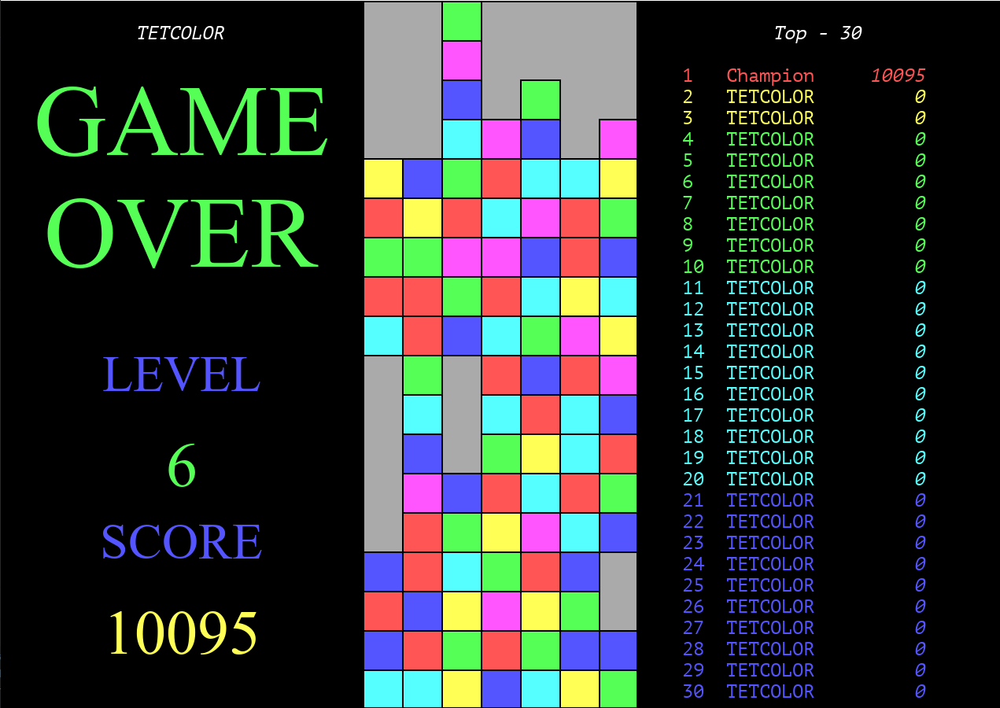

# TETCOLOR

Вариант игры TETCOLOR, написанный на Python.



Для работы требуется библиотека [PyGame](https://www.pygame.org/).


## Компиляция

Возможна компиляция в исполняемый файл. 
Для компиляции требуется установленный [PyInstaller](https://pyinstaller.org/).
Сборка запускается файлом *make_exe.bat*.

## Запуск

```commandline
python Tetcolor.py 
```

или

```commandline
Tetcolor.exe
```

## Управление

* Enter - Запуск новой игры
* Esc - Завершение игры
* P - Пауза/продолжение игры
* S - Включение/выключение звукового сопровождения
* Space - Сброс блока
* Down - Ускоренное перемщение блока вниз
* Left - Сдвиг блока влево
* Right - Сдвиг блока вправо
* Up - Поворот блока по часовой стрелке
* Q - Поворот блока против часовой стрелки

## Подсчет очков

| Вид линии \ Количество удаленных элементов | 3  | 4    | 5    | 6    | 7      |
|--------------------------------------------|----|------|------|------|--------|
| Вертикальная линия                         | 40 | 120  | 440  | 1560 | 5560   |
| Горизонтальная линия                       | 50 | 150  | 550  | 1950 | 6950   |
| Диагональная линия                         | 75 | 225  | 825  | 2925 | 10425  |

При удалении нескольких линий в течении одного хода очки суммируются.
Если после удаления линий появилась комбинация для следующего удаления, то даются бонусные очки.
Для двух удалений подряд - 500, для каждого следующего +1000 очков.

Для уровня большего 5 за каждый ход даются дополнительные очки, независимо от удаленных линий.